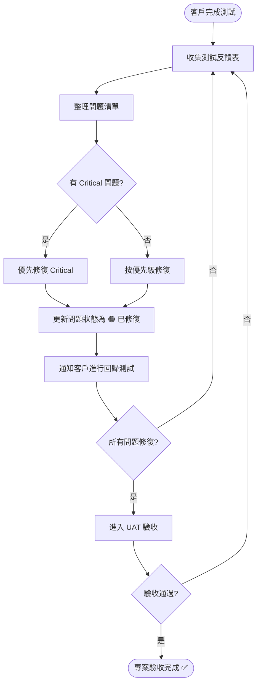

# 客戶測試流程 Skill

## 概述

本 Skill 定義了如何產出一份完整的「客戶測試文檔」，讓客戶（非技術人員）能按照文檔逐步測試系統功能，並提供結構化的反饋。

**前置條件**：
- `需求/需求文檔.md` 已存在且狀態為「已確認」
- 設計文檔（頁面結構圖、流程圖等）已完成（建議但非必要）

**產出文件**：
1. **客戶測試計畫** (`需求/客戶測試計畫.md`) — 測試範圍、時間、角色分工
2. **測試案例清單** (`需求/測試案例.md`) — 逐步操作的測試步驟
3. **測試反饋表** (`devlog/測試反饋.md`) — 客戶填寫的反饋記錄模板

---

## 第一步：閱讀需求與設計文檔

### 1.1 必讀文檔

按以下順序閱讀：
1. `需求/需求文檔.md` — 理解所有功能需求
2. `需求/頁面結構/` — 理解頁面層級與導航路徑
3. `需求/流程圖/` — 理解每個功能的操作流程

### 1.2 提取測試範圍

從需求文檔中提取：
- 所有 **P0** 功能 → 必測項目（不可省略）
- 所有 **P1** 功能 → 重要測試項目（強烈建議）
- 所有 **P2** 功能 → 選測項目（視時間而定）
- 所有 **用戶角色** → 決定測試帳號的設置
- 所有 **業務規則** → 衍生為驗證測試案例

---

## 第二步：撰寫客戶測試計畫

### 2.1 存放位置

`需求/客戶測試計畫.md`

### 2.2 文檔結構

```markdown
# [專案名稱] 客戶測試計畫

> 版本：v1.0
> 建立日期：YYYY-MM-DD
> 測試階段：[第一輪 / 第二輪 / UAT]

---

## 一、測試概述

### 1.1 測試目的
本次測試旨在驗證 [專案名稱] 系統的核心功能是否符合需求文檔中的規格，
確保系統穩定可靠，達到上線標準。

### 1.2 測試範圍

#### 本次測試包含
| # | 功能模塊 | 測試深度 | 優先級 |
|---|---------|---------|--------|
| 1 | [模塊名稱] | 完整測試 | P0 |
| 2 | [模塊名稱] | 核心路徑 | P1 |

#### 本次測試不包含
- [明確列出不在本次測試範圍的功能]
- [例：第三方金流串接（需等待 API 金鑰）]

### 1.3 測試環境

| 項目 | 內容 |
|------|------|
| 測試網址 | [URL] |
| 伺服器環境 | [測試伺服器 / 正式伺服器] |
| 建議瀏覽器 | Chrome 最新版 (建議)、Safari、Firefox |
| 行動裝置 | [iPhone/Android 型號] |

### 1.4 測試帳號

| 角色 | 帳號 | 密碼 | 權限說明 |
|------|------|------|---------|
| 管理員 | admin@test.com | test1234 | 可存取所有功能 |
| 一般用戶 | user@test.com | test1234 | 僅前台功能 |

> ⚠️ 以上為測試用帳號，請勿使用於正式環境

---

## 二、測試時程

| 階段 | 日期 | 內容 | 負責人 |
|------|------|------|--------|
| 第一輪測試 | MM/DD - MM/DD | 核心功能驗證 | [客戶/團隊] |
| 問題修復 | MM/DD - MM/DD | 修復第一輪問題 | 開發團隊 |
| 第二輪測試 | MM/DD - MM/DD | 回歸測試 + 進階功能 | [客戶/團隊] |
| UAT 驗收 | MM/DD | 最終驗收確認 | [客戶] |

---

## 三、反饋方式

### 3.1 問題回報格式
遇到問題時，請提供以下資訊：
1. **問題所在頁面** (截圖或 URL)
2. **操作步驟** (做了什麼動作導致問題)
3. **預期結果** (期望看到什麼)
4. **實際結果** (實際看到什麼)
5. **截圖/錄影** (若可能)
6. **使用裝置與瀏覽器**

### 3.2 問題嚴重程度分類
| 等級 | 定義 | 範例 |
|------|------|------|
| 🔴 嚴重 (Critical) | 系統崩潰或核心功能無法使用 | 無法登入、資料遺失 |
| 🟠 重要 (Major) | 功能有缺陷但有替代方案 | 報表數據不正確 |
| 🟡 一般 (Minor) | 介面問題或非核心功能異常 | 排版跑掉、錯字 |
| 🟢 建議 (Suggestion) | 使用體驗改善建議 | 希望增加快捷鍵 |

---

## 四、驗收標準

### 4.1 通過條件
- [ ] 所有 P0 測試案例通過率 100%
- [ ] P1 測試案例通過率 ≥ 90%
- [ ] 無任何 🔴 嚴重 (Critical) 等級的未修復問題
- [ ] 無任何 🟠 重要 (Major) 等級的未修復問題（或客戶同意延後修復）

### 4.2 驗收簽章
| 角色 | 姓名 | 日期 | 結果 |
|------|------|------|------|
| 客戶代表 | | | ☐ 通過 / ☐ 不通過 |
| 專案負責人 | | | ☐ 通過 / ☐ 不通過 |
```

---

## 第三步：撰寫測試案例 (Test Cases)

### 3.1 存放位置

`需求/測試案例.md`

### 3.2 撰寫原則

1. **面向非技術人員**：語言要簡單直白，避免技術術語
2. **步驟精確**：每個步驟只做一件事，不合併操作
3. **預期結果明確**：用戶看到什麼、出現什麼提示
4. **獨立可執行**：每個測試案例獨立，不依賴其他案例的狀態
5. **涵蓋正反向**：正常操作 + 異常操作（例如輸入錯誤密碼）

### 3.3 文檔結構

```markdown
# [專案名稱] 測試案例

> 版本：v1.0
> 對應需求文檔版本：v1.0
> 建立日期：YYYY-MM-DD

---

## 使用說明

1. 請依照「操作步驟」欄位逐步執行
2. 每完成一個測試案例，在「結果」欄位標記 ✅ 通過 或 ❌ 失敗
3. 若失敗，請在「備註」欄位簡述問題現象
4. 測試完成後，請將本文件交回開發團隊

---

## 模塊一：[模塊名稱]

### TC-001: [測試案例名稱]

| 項目 | 內容 |
|------|------|
| 測試編號 | TC-001 |
| 所屬模塊 | [模塊名稱] |
| 優先級 | P0 |
| 前置條件 | [例：已登入管理員帳號] |
| 對應需求 | [需求文檔的功能編號，如 A-1] |

**操作步驟：**

| 步驟 | 操作 | 預期結果 |
|------|------|---------|
| 1 | 開啟瀏覽器，進入 [URL] | 顯示登入頁面 |
| 2 | 輸入帳號 `[帳號]` 和密碼 `[密碼]` | 帳號密碼欄位顯示已輸入內容 |
| 3 | 點擊「登入」按鈕 | 成功跳轉至主頁面，左上角顯示用戶名稱 |
| 4 | 點擊左側選單的「[功能名稱]」 | 頁面切換至 [功能] 列表頁 |
| 5 | 點擊右上角「新增」按鈕 | 彈出新增表單 |
| 6 | 在「名稱」欄位輸入 `測試資料` | 欄位顯示已輸入文字 |
| 7 | 點擊「儲存」按鈕 | 顯示「新增成功」提示，列表中出現剛新增的資料 |

**測試結果：**

| 結果 | 測試者 | 日期 | 備註 |
|------|--------|------|------|
| ☐ ✅ 通過 / ☐ ❌ 失敗 | | | |

---

### TC-002: [異常場景 - 例：空白表單送出]

| 項目 | 內容 |
|------|------|
| 測試編號 | TC-002 |
| 所屬模塊 | [模塊名稱] |
| 優先級 | P0 |
| 前置條件 | [已登入管理員帳號，並進入新增頁面] |
| 對應需求 | [需求文檔的功能編號] |

**操作步驟：**

| 步驟 | 操作 | 預期結果 |
|------|------|---------|
| 1 | 在新增表單中，不填寫任何欄位 | 所有欄位為空白 |
| 2 | 直接點擊「儲存」按鈕 | 顯示紅色錯誤提示，標示哪些必填欄位未填寫，表單不會送出 |

**測試結果：**

| 結果 | 測試者 | 日期 | 備註 |
|------|--------|------|------|
| ☐ ✅ 通過 / ☐ ❌ 失敗 | | | |
```

### 3.4 測試案例編號規則

- 格式：`TC-XXX`
- 按模塊分組，但編號全域唯一遞增
- 範例：
  - TC-001 ~ TC-010: 用戶管理模塊
  - TC-011 ~ TC-025: 訂單管理模塊
  - TC-026 ~ TC-035: 報表模塊

### 3.5 必須涵蓋的測試類型

每個功能模塊必須包含以下類型的測試案例：

| 測試類型 | 說明 | 範例 |
|---------|------|------|
| **正向測試 (Positive)** | 正常操作，預期成功 | 用正確帳密登入 |
| **反向測試 (Negative)** | 異常操作，預期被攔截 | 用錯誤密碼登入 |
| **邊界測試 (Boundary)** | 極限值測試 | 輸入超長文字、特殊字元 |
| **權限測試 (Permission)** | 不同角色的操作差異 | 一般用戶嘗試訪問管理頁面 |
| **流程測試 (End-to-End)** | 完整業務流程 | 從建立訂單到完成出貨 |

### 3.6 跨裝置測試矩陣（若適用）

```markdown
## 跨裝置/瀏覽器測試

| 測試案例 | Chrome (桌面) | Safari (桌面) | Chrome (Android) | Safari (iOS) |
|---------|:---:|:---:|:---:|:---:|
| TC-001 登入 | ☐ | ☐ | ☐ | ☐ |
| TC-005 新增 | ☐ | ☐ | ☐ | ☐ |
| TC-010 報表 | ☐ | ☐ | ☐ | ☐ |
```

---

## 第四步：建立測試反饋模板

### 4.1 存放位置

`devlog/測試反饋.md`

### 4.2 模板內容

```markdown
# [專案名稱] 測試反饋紀錄

> 本文件用於記錄每次客戶測試的反饋內容。
> 開發團隊將根據此文件追蹤並修復所有問題。

---

## 反饋狀態圖例

| 狀態 | 含義 |
|------|------|
| 🔴 待修復 | 尚未處理 |
| 🟡 修復中 | 開發團隊處理中 |
| 🟢 已修復 | 已修復，待下次測試驗證 |
| ✅ 已驗收 | 客戶確認修復完成 |

---

<!--
  反饋格式：

  ## 第 N 次反饋
  日期：YYYY-MM-DD
  時間：HH:mm

  ### 1. [問題簡述]
  - 嚴重程度：🔴/🟠/🟡/🟢
  - 平台：[Web App / App (Android/iOS)]
  - 端點：[管理端 / 員工端 / 客戶端]
  - 對應測試案例：[TC-XXX]（若適用）
  - 內容：[詳細描述]
  - 截圖：[附上截圖或錄影]
  - 狀態：🔴 待修復

  > **[已修復]** 解決時間：YYYY-MM-DD HH:mm
  > **[已驗收]** 驗收時間：YYYY-MM-DD HH:mm
-->
```

---

## 第五步：產出測試案例的詳細流程

### 5.1 案例撰寫步驟

對於需求文檔中的**每個功能**，按以下順序撰寫：

```
1. 閱讀功能描述 → 理解「這個功能做什麼」
2. 閱讀操作步驟 → 理解「用戶怎麼使用」
3. 閱讀業務規則 → 理解「有哪些限制和條件」
4. 閱讀錯誤處理 → 理解「哪裡可能出錯」
5. 撰寫正向測試案例 → 先寫 Happy Path
6. 撰寫反向測試案例 → 再寫 Error Path
7. 撰寫邊界測試案例 → 最後寫極端情況
8. 與流程圖對照 → 確認沒有遺漏的分支
```

### 5.2 測試覆蓋率檢查

完成所有測試案例後，建立覆蓋率對照表：

```markdown
## 測試覆蓋率

| 需求編號 | 功能名稱 | 正向測試 | 反向測試 | 邊界測試 | 權限測試 |
|---------|---------|:---:|:---:|:---:|:---:|
| A-1 | [功能名] | TC-001 | TC-002 | TC-003 | TC-004 |
| A-2 | [功能名] | TC-005 | TC-006 | - | - |
| B-1 | [功能名] | TC-007 | TC-008 | TC-009 | TC-010 |
```

---

## 第六步：通知用戶

完成所有測試文檔後，向用戶提供交付清單：

```markdown
## 客戶測試文檔已完成

| 文件 | 路徑 | 用途 |
|------|------|------|
| 測試計畫 | 需求/客戶測試計畫.md | 測試範圍、時程、環境 |
| 測試案例 | 需求/測試案例.md | 逐步操作的測試步驟 |
| 測試反饋表 | devlog/測試反饋.md | 客戶記錄問題的模板 |

### 下一步建議
1. 請先審閱測試計畫，確認測試範圍與時程
2. 將測試案例文件提供給客戶
3. 客戶測試後，收集反饋記錄到測試反饋表
4. 開發團隊根據反饋修復問題
5. 進行回歸測試，直到驗收通過
```

---

## 第七步：同步更新關聯文件

1. 更新 `devlog/devlog.md` 記錄測試計畫完成
2. 在當日 devlog (`devlog/YYYY-MM-DD-devlog.md`) 記錄文檔完成時間
3. 確保 `需求/需求文檔.md` 中的「測試計畫」章節指向新建的文件

---

## 測試迭代流程

每輪測試完成後的處理流程：



---

## 注意事項

> [!CAUTION]
> - **面向客戶**：所有文檔語言必須簡單易懂，避免技術術語
> - **獨立可執行**：每個測試案例不應依賴其他案例的執行結果
> - **禁止**只寫正向測試而省略反向測試
> - **禁止**測試步驟模糊不清（如「填寫表單」→ 應寫「在名稱欄位輸入 xxx」）
> - **禁止**預期結果寫「正常」→ 應具體描述用戶看到什麼
> - **必須**每個 P0 功能至少有一個正向 + 一個反向測試案例
> - 測試帳號密碼**僅限測試環境使用**，禁止使用正式環境帳號
