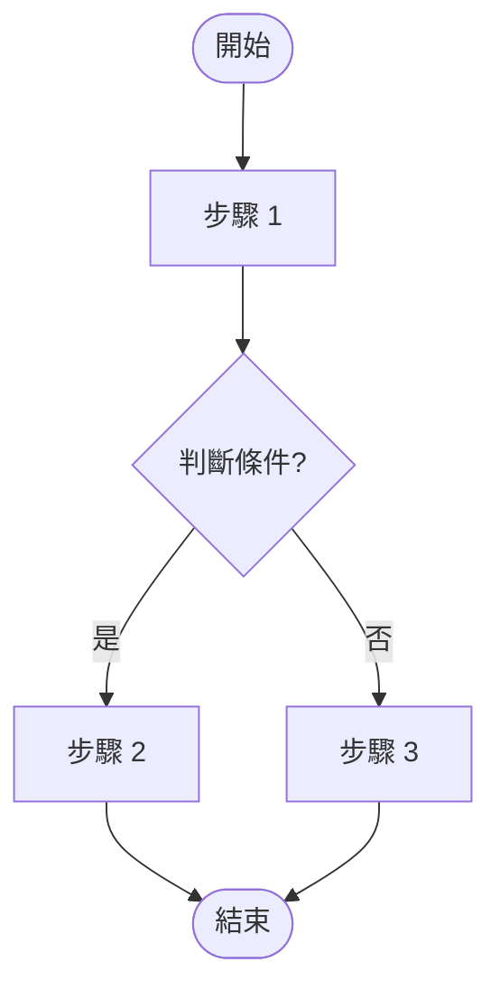

# 開發流程設計 Skill

## 概述

本 Skill 定義了從「已確認的需求文檔」到「產出完整設計圖集」的流程。  
**前置條件**：`需求/需求文檔.md` 已存在且狀態為「已確認」。若未確認，請先使用「需求文檔撰寫」Skill。

本 Skill 將產出以下設計文件：
1. **頁面結構圖** — 系統所有頁面的層級關係
2. **功能流程圖** — 每個核心功能的操作流程
3. **系統架構圖** — 前後端、資料庫、第三方服務的整體架構
4. **資料庫 ER 圖** — Entity Relationship 設計
5. **API 設計文檔** — RESTful API 的完整定義

---

## 第一步：閱讀需求文檔

### 1.1 載入需求

- 完整閱讀 `需求/需求文檔.md`
- 提取所有功能模塊、用戶角色、業務規則
- 確認技術棧選型（影響架構圖的繪製）

### 1.2 建立設計清單

根據需求文檔，列出所有需要繪製的設計圖：

```markdown
## 設計圖清單

### 頁面結構圖
- [ ] 前台頁面結構
- [ ] 後台頁面結構
- [ ] [其他端點頁面結構]

### 功能流程圖
- [ ] [功能 A] 操作流程
- [ ] [功能 B] 操作流程
- [ ] ...

### 系統架構圖
- [ ] 系統部署架構圖
- [ ] [其他架構圖]

### 資料庫設計
- [ ] ER 圖
- [ ] 資料表清單
```

### 1.3 技術棧規劃 (Technology Stack)

在開始繪製任何設計圖之前，**必須**先確定並記錄完整的技術棧選型。這直接影響系統架構圖、資料庫設計與 API 設計的內容。

#### 技術棧文檔

在 `需求/` 目錄下建立或更新 `需求/技術棧.md`，格式如下：

```markdown
# [專案名稱] 技術棧

> 建立日期：YYYY-MM-DD
> 最後更新：YYYY-MM-DD

---

## 一、技術棧總覽

| 層級 | 技術 | 版本 | 用途 | 選擇理由 |
|------|------|------|------|---------|
| **前端框架** | [React / Vue / Angular / Next.js] | [版本號] | [Web 介面] | [選擇原因] |
| **前端 UI 庫** | [Material-UI / Ant Design / Tailwind CSS] | [版本號] | [UI 組件] | [選擇原因] |
| **前端語言** | [TypeScript / JavaScript] | [版本號] | [類型安全] | [選擇原因] |
| **前端建構** | [Vite / Webpack / Next.js 內建] | [版本號] | [開發伺服器 + 打包] | [選擇原因] |
| **行動端** | [Flutter / React Native / 無] | [版本號] | [跨平台 App] | [選擇原因] |
| **後端框架** | [Spring Boot / Express / Django / NestJS] | [版本號] | [API 服務] | [選擇原因] |
| **後端語言** | [Java / Node.js / Python / Go] | [版本號] | [服務端邏輯] | [選擇原因] |
| **主資料庫** | [PostgreSQL / MySQL / MongoDB] | [版本號] | [持久化資料] | [選擇原因] |
| **快取** | [Redis / Memcached / 無] | [版本號] | [Session / 快取] | [選擇原因] |
| **ORM** | [TypeORM / Prisma / Hibernate / SQLAlchemy] | [版本號] | [資料庫操作] | [選擇原因] |
| **認證方式** | [JWT / Session / OAuth 2.0] | - | [身份驗證] | [選擇原因] |
| **檔案存儲** | [Local / AWS S3 / MinIO] | - | [上傳檔案] | [選擇原因] |
| **容器化** | [Docker / Docker Compose] | [版本號] | [環境一致性] | [選擇原因] |
| **反向代理** | [Nginx / Traefik / 無] | [版本號] | [請求轉發] | [選擇原因] |
| **CI/CD** | [GitHub Actions / GitLab CI / 無] | - | [自動部署] | [選擇原因] |

## 二、開發環境配置

### 2.1 開發工具
- IDE/Editor：[VS Code / IntelliJ IDEA / Android Studio]
- 版本控制：Git
- 套件管理：[npm / yarn / pnpm / Maven / Gradle / pip]

### 2.2 本地開發環境要求
- Node.js：>= [版本]
- Java：[版本]
- Docker：[版本]
- [其他工具]

### 2.3 Docker 開發環境
| 服務 | 容器名稱 | 內部端口 | 對外端口 | 說明 |
|------|---------|---------|---------|------|
| 前端 | [project]-frontend | [3000] | [3000] | [開發伺服器] |
| 後端 | [project]-backend | [8080] | [8080] | [API 服務] |
| 資料庫 | [project]-postgres | [5432] | [5432] | [PostgreSQL] |
| 快取 | [project]-redis | [6379] | [6379] | [Redis] |

## 三、第三方服務

| 服務類型 | 服務商 | 用途 | 費用模式 | 是否必要 |
|---------|--------|------|---------|---------|
| 金流 | [綠界 / 藍新 / Stripe] | [線上支付] | [交易手續費 X%] | [是/否] |
| 簡訊 | [Twilio / 三竹] | [驗證碼] | [每則 $X] | [是/否] |
| Email | [SendGrid / AWS SES] | [通知信] | [每月免費 X 封] | [是/否] |
| 地圖 | [Google Maps / Mapbox] | [地址/定位] | [每月免費 X 次] | [是/否] |
| 雲端存儲 | [AWS S3 / GCS] | [檔案上傳] | [儲存量計費] | [是/否] |

## 四、專案結構規劃

```
[專案名稱]/
├── frontend/                 # 前端
│   ├── web/                  # Web 前端
│   │   ├── src/
│   │   │   ├── components/   # 共用組件
│   │   │   ├── pages/        # 頁面
│   │   │   ├── services/     # API 呼叫
│   │   │   ├── stores/       # 狀態管理
│   │   │   ├── types/        # TypeScript 型別
│   │   │   └── utils/        # 工具函數
│   │   └── package.json
│   └── app/                  # 行動端 (Flutter / React Native)
├── backend/                  # 後端
│   ├── src/
│   │   ├── controllers/      # 控制器層
│   │   ├── services/         # 服務層
│   │   ├── repositories/     # 資料存取層
│   │   ├── entities/         # 資料實體
│   │   ├── dtos/             # 資料傳輸物件
│   │   ├── middlewares/      # 中間件
│   │   └── config/           # 配置
│   └── [build file]
├── docker/                   # Docker 配置
│   ├── local/                # 本地環境
│   └── server/               # 伺服器環境
├── env/                      # 環境變數
│   ├── local/
│   └── server/
├── devlog/                   # 開發日誌
├── 需求/                      # 需求文檔
└── README.md
```

## 五、版本與相容性約束

列出任何需要鎖定的版本或已知的相容性限制：
- [例：React 18 不相容某套件，鎖定 React 17]
- [例：PostgreSQL 必須 >= 14 才支援某功能]
```

#### 技術棧選型原則

AI 在選型時應考慮以下因素：

1. **需求匹配**：技術是否能滿足功能需求（如即時通訊需要 WebSocket）
2. **團隊熟悉度**：優先選擇用戶/團隊已熟悉的技術
3. **社群活躍度**：優先選擇社群活躍、文檔完善的技術
4. **長期維護**：避免選擇已停止維護或即將過時的技術
5. **效能需求**：根據並發量、資料量級選擇合適的技術
6. **成本考量**：第三方服務需列出費用模式

#### 技術棧確認流程

1. 根據需求文檔中的「技術棧 (初步規劃)」為基礎
2. 結合功能需求補充必要的技術選型
3. **必須**向用戶確認技術棧選型
4. 用戶確認後，將技術棧寫入 `.cursor/rules/projectrule.mdc`

---

## 第二步：頁面結構圖 (Page Structure)

### 2.1 存放位置

所有頁面結構圖**必須**存放於 `需求/頁面結構/` 目錄下。

### 2.2 繪製規範

使用 Mermaid Flowchart (`graph LR`) 語法，遵守以下規範：

1. **方向**：左到右 (LR) 的樹狀展開
2. **層級標記**：每個節點必須添加 `:::levelN` 樣式
3. **配色規範**：
   - Level 1 (主節點): `fill:#f97316,stroke:none,color:white`
   - Level 2 (二級): `fill:#0d9488,stroke:none,color:white`
   - Level 3 (三級): `fill:#8b5cf6,stroke:none,color:white`
   - Level 4 (四級): `fill:#ec4899,stroke:none,color:white`

### 2.3 標準模板

每個端點（前台/後台）獨立建立一個 .md 檔案：

```markdown
# [前台/後台] 頁面結構

> 請使用支援 Mermaid 預覽的編輯器 (如安裝了 Mermaid 插件的 VS Code) 查看

​```mermaid
graph LR
    %% ========== 主節點 ==========
    Main["[端點名稱] 主畫面"]:::level1

    %% ========== 第二層：主要模塊 ==========
    Main --> ModA["模塊 A"]:::level2
    Main --> ModB["模塊 B"]:::level2

    %% ========== 第三層：子功能 ==========
    ModA --> A1["功能 A-1"]:::level3
    ModA --> A2["功能 A-2"]:::level3
    
    ModB --> B1["功能 B-1"]:::level3

    %% ========== 第四層：細項 ==========
    A1 --> A1a["細項 A-1-a"]:::level4

    %% ========== 樣式定義 ==========
    classDef level1 fill:#f97316,stroke:none,color:white;
    classDef level2 fill:#0d9488,stroke:none,color:white;
    classDef level3 fill:#8b5cf6,stroke:none,color:white;
    classDef level4 fill:#ec4899,stroke:none,color:white;
​```
```

### 2.4 命名規範

- 檔案名稱：`[端點名]頁面結構.md`（例：`前台頁面結構.md`、`後台頁面結構.md`）
- 節點 ID：使用英文縮寫，避免中文（Mermaid 相容性）
- 節點標籤：使用繁體中文，用 `["文字"]` 包覆

### 2.5 頁面結構完整性檢查

繪製完成後，必須與需求文檔逐一對照：
- [ ] 需求文檔中提到的每個功能是否都有對應的頁面節點？
- [ ] 每個用戶角色的操作路徑是否都能在頁面結構中找到？
- [ ] 頁面層級是否合理（建議不超過 4 層）？

---

## 第三步：功能流程圖 (Function Flowcharts)

### 3.1 存放位置

所有功能流程圖**必須**存放於 `需求/流程圖/` 目錄下。

### 3.2 繪製規範

使用 Mermaid Flowchart (`graph TD`) 語法，上到下 (TD) 流向：



### 3.3 節點類型標準

| 節點類型 | Mermaid 語法 | 使用場景 |
|---------|-------------|---------|
| 開始/結束 | `(["文字"])` | 流程起點與終點 |
| 操作步驟 | `["文字"]` | 用戶或系統執行的動作 |
| 判斷條件 | `{"文字?"}` | 條件分支 |
| 資料輸入/輸出 | `[/"文字"/]` | 表單輸入、API 回應 |
| 子流程 | `[["文字"]]` | 引用其他流程圖 |

### 3.4 流程圖製作清單

根據需求文檔中的每個 P0 功能，**必須**繪製對應的流程圖。P1 功能建議繪製。對於每個流程圖，需包含：

1. **正常流程 (Happy Path)**：用戶正常操作的完整路徑
2. **異常流程 (Error Path)**：錯誤處理、驗證失敗的分支
3. **權限判斷**：不同角色的操作差異（若有）

### 3.5 命名規範

- 檔案名稱：`[功能名稱]-流程圖.md`（例：`訂單建立-流程圖.md`）
- 每個 .md 檔案只包含一個流程圖（保持聚焦）

### 3.6 複雜流程的處理

若流程過於複雜（超過 15 個節點），應拆分為多個子流程：
1. 主流程圖：展示整體流程骨架，每個複雜步驟引用子流程
2. 子流程圖：獨立的 .md 檔案，詳細展開複雜步驟

---

## 第四步：系統架構圖 (System Architecture)

### 4.1 存放位置

存放於 `需求/流程圖/系統架構圖.md`。

### 4.2 繪製內容

使用 Mermaid Flowchart 繪製系統整體架構，必須包含：

```markdown
# 系統架構圖

​```mermaid
graph TB
    subgraph Client["客戶端 (Client)"]
        Web["Web App<br/>React + TypeScript"]
        App["Mobile App<br/>Flutter"]
    end

    subgraph Server["伺服器 (Server)"]
        API["API Server<br/>Spring Boot"]
        Auth["認證服務<br/>JWT"]
    end

    subgraph Storage["資料存儲 (Storage)"]
        DB[("PostgreSQL<br/>主資料庫")]
        Cache[("Redis<br/>快取")]
        Files["檔案存儲<br/>Local/S3"]
    end

    subgraph External["第三方服務"]
        Payment["金流服務"]
        SMS["簡訊服務"]
    end

    Web --> API
    App --> API
    API --> Auth
    API --> DB
    API --> Cache
    API --> Files
    API --> Payment
    API --> SMS
​```
```

### 4.3 架構圖要素

必須涵蓋以下要素（適用時）：
- [ ] 前端應用（Web / App / 兩者）
- [ ] 後端 API 服務
- [ ] 資料庫（主庫、讀寫分離、快取）
- [ ] 檔案存儲
- [ ] 認證服務
- [ ] 第三方服務（金流、簡訊、Email 等）
- [ ] 反向代理 / 負載均衡（生產環境）
- [ ] Docker 容器關係（開發環境）

---

## 第五步：資料庫 ER 圖 (Entity Relationship)

### 5.1 存放位置

存放於 `需求/流程圖/資料庫設計.md`。

### 5.2 繪製規範

使用 Mermaid `erDiagram` 語法：

```markdown
# 資料庫設計

## ER 圖

​```mermaid
erDiagram
    users {
        bigint id PK
        varchar username
        varchar email
        varchar password_hash
        timestamp created_at
        timestamp updated_at
        timestamp deleted_at
    }
    
    orders {
        bigint id PK
        bigint user_id FK
        varchar order_number
        decimal total_amount
        varchar status
        timestamp created_at
        timestamp updated_at
    }
    
    users ||--o{ orders : "has many"
​```

## 資料表清單

| # | 資料表名稱 | 說明 | 主要欄位 | 關聯 |
|---|----------|------|---------|------|
| 1 | users | 用戶表 | id, username, email | - |
| 2 | orders | 訂單表 | id, user_id, order_number | users (FK) |
```

### 5.3 資料表設計規範

每個資料表必須遵守：
1. **必備欄位**：`id` (PK), `created_at`, `updated_at`
2. **軟刪除**：重要商業資料使用 `deleted_at` 欄位
3. **命名規範**：資料表和欄位一律使用小寫 `snake_case`
4. **索引**：Foreign Key 和頻繁查詢欄位必須標註需建立 Index
5. **類型明確**：每個欄位必須標明資料類型

---

## 第六步：API 設計文檔 (API Design)

### 6.1 存放位置

存放於 `需求/API設計.md`。

### 6.2 文檔結構

```markdown
# API 設計文檔

> Base URL: `/api/v1`
> 認證方式: Bearer Token (JWT)

## 統一回應格式

### 成功回應
​```json
{
  "success": true,
  "data": {},
  "message": "操作成功"
}
​```

### 錯誤回應
​```json
{
  "success": false,
  "error": {
    "code": "ERROR_CODE",
    "message": "錯誤描述"
  }
}
​```

---

## [模塊名稱] API

### [功能名稱]

- **Method**: `POST`
- **Path**: `/api/v1/[resource]`
- **認證**: 需要 / 不需要
- **權限**: [角色列表]
- **描述**: [一句話描述]

**Request Body**:
​```json
{
  "field_1": "string (必填, 說明)",
  "field_2": 0
}
​```

**Response (200)**:
​```json
{
  "success": true,
  "data": {
    "id": 1,
    "field_1": "value"
  }
}
​```

**Error Cases**:
| HTTP Status | Error Code | 觸發條件 |
|-------------|-----------|---------|
| 400 | INVALID_INPUT | 必填欄位缺失 |
| 401 | UNAUTHORIZED | 未登入 |
| 403 | FORBIDDEN | 權限不足 |
```

### 6.3 API 設計原則

1. **資源導向**：URL 使用名詞複數（`/users`, `/orders`）
2. **HTTP Method 正確使用**：
   - `GET` = 查詢（無副作用）
   - `POST` = 新增
   - `PUT` = 完整更新
   - `PATCH` = 部分更新
   - `DELETE` = 刪除
3. **版本控制**：所有 API 路徑包含版本號（`/api/v1/`）
4. **分頁**：列表 API 必須支援分頁（`page`, `size`, `total`）
5. **篩選排序**：列表 API 應支援 query params 篩選

---

## 第七步：匯出與整理

### 7.1 圖表匯出

所有 Mermaid 圖表完成後，如需匯出 PNG：
- 參數：`-b white -w 7680 -H 4320 -s 4`
- PNG 與 .md 放在同一目錄

### 7.2 完成檢查清單

- [ ] 頁面結構圖是否涵蓋所有端點（前台/後台）
- [ ] P0 功能是否都有對應的流程圖
- [ ] 系統架構圖是否反映實際技術棧
- [ ] ER 圖是否涵蓋所有核心資料表
- [ ] API 設計是否涵蓋 CRUD 基本操作
- [ ] 所有圖表的文字皆使用繁體中文
- [ ] 所有檔案存放於正確目錄

### 7.3 通知用戶

完成所有設計圖後，向用戶提供設計圖清單與檔案連結：

```markdown
## 設計文件已完成

| 文件 | 路徑 | 狀態 |
|------|------|------|
| 前台頁面結構 | 需求/頁面結構/前台頁面結構.md | ✅ |
| 後台頁面結構 | 需求/頁面結構/後台頁面結構.md | ✅ |
| [功能] 流程圖 | 需求/流程圖/[功能]-流程圖.md | ✅ |
| 系統架構圖 | 需求/流程圖/系統架構圖.md | ✅ |
| 資料庫設計 | 需求/流程圖/資料庫設計.md | ✅ |
| API 設計 | 需求/API設計.md | ✅ |
```

---

## 注意事項

> [!CAUTION]
> - **前置條件**：需求文檔必須已確認才能開始設計
> - **禁止**未經與需求文檔對照就開始繪圖
> - **禁止**省略異常流程（Error Path）的流程圖
> - **禁止**資料表設計缺少 `id`、`created_at`、`updated_at` 必備欄位
> - **禁止**API 路徑使用動詞（應用名詞複數）
> - 所有設計圖**必須**由用戶確認後方可進入開發階段
