# POS 系統模塊化需求文檔 (POS System Modular Requirements Document)

> **版本**: v1.0
> **建立日期**: 2026-04-07
> **基於**: 企業模塊化組件系統企畫書
> **狀態**: 初版草案
> **受眾**: 產品經理、客戶、任何人
> **用途**: 本文件為產品視角，定義系統「做什麼」（WHAT）。資料表結構與 Feature Toggle YAML 等工程細節請參閱 [技術規格.md](技術規格.md)。開發排程與實作策略請參閱 [流程圖/開發流程規劃.md](流程圖/開發流程規劃.md)。

---

## 一、專案概述 (Project Overview)

### 1.1 專案背景

本 POS 系統是「企業模塊化組件系統」下的第一個實際應用專案。系統採用模塊化架構，透過 Feature Toggle 功能開關實現快速客製化，使同一套程式碼基底可服務不同業態的客戶——從小型咖啡廳到連鎖餐飲集團。

### 1.2 適用業態

| 業態 | 說明 | 典型場景 |
|------|------|---------|
| 零售門市 | 服飾店、超商、3C 賣場、書店 | 條碼掃描結帳、庫存管理 |
| 速食餐飲 | 速食店、飲料店、食物卡車 | 快速點餐、廚房出單 |
| 正式餐廳 | 中西餐廳、火鍋店、居酒屋 | 桌位管理、分單結帳、出餐管理 |
| 咖啡廳 | 咖啡館、甜品店、麵包坊 | 客製化飲品、會員儲值 |
| 連鎖總部 | 連鎖品牌總部管理 | 多門店報表、統一庫存、促銷下發 |

### 1.3 核心策略

1. **模塊化開發 (Modular Development)**: 功能按模組拆分，每個模組獨立開發、測試、啟停
2. **Feature Toggle (功能開關)**: 透過 `@ConditionalOnProperty` 控制模組啟用，不同客戶組合不同模組
3. **單一資料庫 (Single DB)**: 所有模組共用一個 PostgreSQL，以表前綴區分
4. **軟刪除 (Soft Delete)**: 所有商業資料使用 `deleted_at` 標記刪除，確保歷史資料完整性
5. **離線優先 (Offline First)**: POS 終端支援斷線運作，網路恢復後自動同步

### 1.4 技術棧（繼承母體系統）

| 層級 | 技術選型 | 說明 |
|------|---------|------|
| 後端框架 | Spring Boot 3.x (Java 21) | 單一 JAR，內含所有啟用模組 |
| ORM | JPA / Hibernate | 資料存取層 |
| 排程 | Quartz Scheduler | 定時任務（日結、同步） |
| 前端 Web | React + TypeScript + Vite + MUI + Zustand | 管理後台 |
| 前端 POS 終端 | Flutter (Dart) | iPad / Android 平板收銀 |
| 資料庫 | PostgreSQL | 單一資料庫，表以前綴區分 |
| 快取 | Redis | Session、商品快取、即時庫存 |
| 容器化 | Docker + Docker Compose | 4 容器部署 |
| 反向代理 | Nginx | 前後端路由 |
| DB 遷移 | Flyway | 版本化遷移腳本 |

---

## 二、系統架構 (System Architecture)

### 2.1 部署拓撲

```
┌────────────────────── 客戶端 ──────────────────────┐
│  POS 終端 (Flutter/iPad)  |  管理後台 (React/Web)  │
│  + 離線 SQLite 本地儲存    |  + 報表與設定管理       │
└──────────────┬─────────────────────┬───────────────┘
               │                     │
┌──────────────▼─────────────────────▼───────────────┐
│          Docker: frontend (Nginx)                   │
│    靜態檔案 + 反向代理 /api → backend                │
└──────────────────────┬─────────────────────────────┘
                       │
┌──────────────────────▼─────────────────────────────┐
│          Docker: backend (Spring Boot)              │
│    單一 JAR，內含所有啟用的 POS 業務模組              │
│    核心POS | 商品 | 支付 | 庫存 | 會員 | 稅務 | ... │
│    + WebSocket (廚房顯示、即時通知)                   │
└──────────────────────┬─────────────────────────────┘
                       │
┌──────────────────────▼─────────────────────────────┐
│   Docker: postgres          Docker: redis           │
│   單一資料庫 (pos_ 前綴)     快取 + Session + 即時庫存 │
└─────────────────────────────────────────────────────┘
```

### 2.2 模組層次圖

```
┌─────────────────────────────────────────────────────────────┐
│                    module-common (共用基礎)                   │
│  BaseEntity | ApiResponse | JWT | RBAC | 工具類 | Feature Toggle │
└──────────────────────────┬──────────────────────────────────┘
                           │
┌──────────────────────────▼──────────────────────────────────┐
│              第一層：複用母體模組 (Reused Modules)              │
│  module-auth | module-organization | module-workflow         │
│  module-notification | module-audit | module-system          │
│  module-report                                               │
└──────────────────────────┬──────────────────────────────────┘
                           │
┌──────────────────────────▼──────────────────────────────────┐
│              第二層：擴展模組 (Extended Modules)               │
│  module-pos-inventory (擴展自 module-inventory)               │
│  module-pos-crm (擴展自 module-crm)                          │
└──────────────────────────┬──────────────────────────────────┘
                           │
┌──────────────────────────▼──────────────────────────────────┐
│              第三層：POS 專屬模組 (POS-Specific Modules)       │
│  module-pos-core | module-pos-product | module-pos-payment   │
│  module-pos-tax | module-pos-staff | module-pos-promotion    │
│  module-pos-printing | module-pos-sync | module-pos-hardware │
│  module-pos-kitchen | module-pos-table | module-pos-delivery │
│  module-pos-supplier | module-pos-reservation                │
└─────────────────────────────────────────────────────────────┘
```

---

## 三、模組優先級總覽 (Module Priority Overview)

### 全部 23 個模組

| 優先級 | 模組代碼 | 模組名稱 | 來源 | 適用業態 |
|--------|---------|---------|------|---------|
| **P0** | module-auth | 認證與授權 | 複用+擴展 | 全部 |
| **P0** | module-organization | 組織架構與門店管理 | 複用+擴展 | 全部 |
| **P0** | module-pos-core | 核心 POS 交易與結帳 | 新建 | 全部 |
| **P0** | module-pos-product | 商品與菜單管理 | 新建 | 全部 |
| **P0** | module-pos-payment | 支付管理 | 新建 | 全部 |
| **P0** | module-pos-inventory | 全通路庫存同步 | 擴展 | 全部 |
| **P0** | module-pos-tax | 稅務與電子發票 | 新建 | 全部 |
| **P1** | module-pos-crm | CRM 會員與忠誠度管理 | 擴展 | 全部 |
| **P1** | module-pos-staff | 排班與班次管理 | 新建 | 全部 |
| **P1** | module-pos-promotion | 促銷與優惠券引擎 | 新建 | 全部 |
| **P1** | module-pos-printing | 列印管理 | 新建 | 全部 |
| **P1** | module-pos-sync | 資料同步與備份 | 新建 | 全部 |
| **P1** | module-pos-hardware | 硬體與周邊管理 | 新建 | 全部 |
| **P1** | module-workflow | 審批流程引擎 | 複用 | 全部 |
| **P1** | module-notification | 通知系統 | 複用 | 全部 |
| **P1** | module-report | 報表與數據分析 | 複用 | 全部 |
| **P1** | module-audit | 稽核日誌 | 複用 | 全部 |
| **P1** | module-system | 系統設定 | 複用 | 全部 |
| **P2** | module-pos-kitchen | 廚房顯示系統 (KDS) | 新建 | 餐飲業 |
| **P2** | module-pos-table | 桌位管理 | 新建 | 內用餐廳 |
| **P2** | module-pos-delivery | 外送與外帶管理 | 新建 | 餐飲/零售 |
| **P2** | module-pos-supplier | 供應商與採購管理 | 新建 | 全部 |
| **P3** | module-pos-reservation | 預約系統 | 新建 | 餐廳 |

---

## 四、各模組詳細需求 (Detailed Module Requirements)

---

### 模組 01：認證與授權 (module-auth) — P0 ｜複用+擴展

> 複用母體系統 module-auth，新增 POS 專屬的 PIN 登入與快速切換功能。

#### 功能列表

| 功能 | 說明 |
|------|------|
| 帳號密碼登入 | BCrypt/Argon2 驗證，用於管理後台登入 |
| JWT Token | Access Token (15min) + Refresh Token (7days) |
| PIN 碼快速登入 | POS 終端使用 4-6 位 PIN 碼快速登入，適合門市多人共用機台 |
| 快速切換帳號 | 不需完全登出，輸入 PIN 碼即可切換當前操作員 |
| 店長權限覆蓋 | 需要授權的操作（退款、作廢、折扣）由店長刷卡或輸入密碼授權 |
| 基於角色的存取控制 (RBAC) | 預設 POS 角色定義 |
| 登入失敗鎖定 | PIN 碼連續錯誤 5 次鎖定 30 分鐘 |
| 終端機綁定認證 | POS 終端機需先註冊綁定，防止未授權裝置存取系統 |
| 自動鎖屏 | 閒置超時自動鎖定螢幕，需重新輸入 PIN 解鎖 |

#### POS 預設角色

| 角色 | 權限範圍 |
|------|---------|
| `CASHIER` (收銀員) | 結帳、加入購物車、基本查詢、自身交接班 |
| `SHIFT_MANAGER` (值班主管) | 收銀員權限 + 退款授權（限額內）、折扣授權、作廢訂單、查看當班報表 |
| `STORE_MANAGER` (店長) | 值班主管權限 + 無限額退款、修改商品價格、查看全店報表、管理員工排班 |
| `AREA_MANAGER` (區域經理) | 店長權限 + 跨門店報表、調撥審批 |
| `ADMIN` (系統管理員) | 全部權限 + 系統設定、模組開關、全域配置 |

#### Spring Event

- **發布**: `UserLoggedInEvent`, `UserSwitchedEvent`, `ManagerOverrideEvent`
- **消費**: 無

---

### 模組 02：組織架構與門店管理 (module-organization) — P0 ｜複用+擴展

> 複用母體系統 module-organization，新增門店、區域、收銀終端管理。

#### 功能列表

| 功能 | 說明 |
|------|------|
| 公司/品牌管理 | 集團或品牌層級的基本資料設定 |
| 區域管理 | 區域劃分（北區、中區、南區等），區域經理指派 |
| 門店管理 | 建立與管理實體門市資料——地址、營業時間、電話、時區、幣別 |
| 門店營業設定 | 每間門店的稅務設定、預設支付方式、收據格式等 |
| 員工管理 | 員工基本資料、歸屬門店、角色指派 |
| 員工門店歸屬 | 員工綁定至特定門店，限制只能登入所屬門店 POS |
| 員工多門店支援 | 支援員工隸屬多間門店（兼職人員、支援人力） |
| 收銀機 / 終端機管理 | 登記每台 POS 終端（Terminal ID）、綁定門店、硬體設定檔 |
| 終端機狀態監控 | 追蹤終端機的在線狀態、最後心跳時間、版本資訊 |
| 組織圖 | 視覺化：公司 → 區域 → 門店 → 終端機 層級架構 |

#### Spring Event

- **發布**: `StoreCreatedEvent`, `StoreUpdatedEvent`, `TerminalRegisteredEvent`, `TerminalOfflineEvent`
- **消費**: `EmployeeCreatedEvent` (自動建立門店歸屬)

---

### 模組 03：核心 POS 交易與結帳 (module-pos-core) — P0 ｜新建

> POS 系統的心臟，處理所有交易流程，每個客戶都必備。

#### 功能列表

| 功能 | 說明 |
|------|------|
| **商品瀏覽** | 格狀/列表顯示、分類導航、觸控選取加入購物車 |
| **條碼掃描** | 支援 EAN-13 / Code-128 / QR Code 掃描加入商品 |
| **商品搜尋** | 依名稱、SKU、條碼模糊搜尋 |
| **購物車管理** | 加入/移除商品、修改數量、單品備註、客製化選項 (Modifiers) |
| **訂單計價引擎** | 小計計算、稅額計算（含稅/未稅切換）、折扣折讓、進位規則 |
| **多元支付** | 現金、信用卡、行動支付、儲值卡、點數折抵、禮品卡 |
| **混合支付** | 單筆訂單使用多種支付方式（如部分現金 + 部分刷卡） |
| **找零計算** | 自動計算找零金額，支援快捷金額按鈕 |
| **離線運作 (Offline Mode)** | 網路斷線時將訂單暫存 IndexedDB/SQLite，恢復後自動同步 |
| **退貨處理** | 透過原始訂單號查詢並進行退款，自動回溯庫存與財務 |
| **換貨處理** | 退回原商品 + 購買新商品的組合流程 |
| **訂單作廢 (Void)** | 作廢整筆訂單或單一品項，超過金額門檻需主管授權 |
| **訂單暫掛 (Hold)** | 暫時擱置訂單，稍後召回繼續結帳 |
| **訂單召回 (Recall)** | 從暫掛列表或訂單歷史召回訂單 |
| **合併訂單** | 將多筆暫掛訂單合併為一筆 |
| **分單結帳 (Split Bill)** | 按品項分帳、均分、按金額分帳、按座位分帳（餐廳場景） |
| **折扣類型** | 百分比折扣、固定金額折扣、買 X 送 Y、員工折扣、手動折扣（需授權） |
| **禮品卡** | 販售禮品卡、兌換禮品卡、查詢餘額、儲值 |
| **快速銷售** | 雜項商品輸入（開放價格品項），無需建立商品資料 |
| **訂單備註** | 整筆訂單或單一品項的特殊指示 |
| **顧客螢幕** | 副螢幕顯示掃描品項、小計、總計、支付進度 |
| **訂單類型** | 內用 (DINE_IN) / 外帶 (TAKEOUT) / 外送 (DELIVERY) / 自取 (PICKUP) |
| **重印收據** | 查詢歷史訂單並重新列印收據 |
| **訂單歷史查詢** | 依日期、訂單號、員工、門店查詢歷史訂單 |

#### 訂單生命週期狀態機

```
DRAFT → CONFIRMED → PREPARING → READY → COMPLETED → CLOSED
                                    ↓
                                  VOIDED
                                    ↓
                                 REFUNDED (部分或全額)
```

| 狀態 | 說明 | 可執行操作 |
|------|------|-----------|
| `DRAFT` | 購物車階段，尚未確認 | 新增/移除品項、修改數量、暫掛 |
| `CONFIRMED` | 已確認，等待備餐（餐飲）或直接結帳（零售） | 送廚房、開始結帳 |
| `PREPARING` | 廚房製作中 | 查看進度（僅餐飲業） |
| `READY` | 備餐完成 / 等待取餐 | 完成訂單 |
| `COMPLETED` | 已結帳完成 | 退款、重印收據 |
| `CLOSED` | 已日結，不可再修改 | 僅查詢 |
| `VOIDED` | 已作廢 | 僅查詢 |
| `REFUNDED` | 已退款（全額或部分） | 僅查詢 |

#### Spring Event

- **發布**: `OrderCreatedEvent`, `OrderConfirmedEvent`, `OrderCompletedEvent`, `OrderVoidedEvent`, `RefundCompletedEvent`, `GiftCardActivatedEvent`
- **消費**: `PaymentProcessedEvent`, `PromotionAppliedEvent`, `KitchenOrderReadyEvent`

---

### 模組 04：商品與菜單管理 (module-pos-product) — P0 ｜新建

> 管理所有販售商品的目錄、分類、價格、客製化選項。

#### 功能列表

| 功能 | 說明 |
|------|------|
| **商品分類管理** | 樹狀多層分類（如：飲品 > 熱飲 > 咖啡），排序、顯示控制 |
| **商品 CRUD** | 名稱、描述、SKU、條碼、圖片、基礎價格、成本價、稅務類別、計量單位 |
| **多條碼支援** | 同一商品可綁定多個條碼（EAN-13、Code-128、QR Code） |
| **價格管理** | 基礎價格、門店專屬價格覆蓋、時段價格（Happy Hour）、會員價、批量價 |
| **客製化選項 (Modifiers)** | 修飾群組（如「大小」S/M/L 各有加價、「加料」多選），必選/可選設定 |
| **套餐 / 組合餐 (Combo)** | 定義組合（如「選 1 主餐 + 1 配菜 + 1 飲品」），套餐價 vs 單品價合計 |
| **商品變體 (Variants)** | 尺寸/顏色/口味等變體，各有獨立 SKU 和價格 |
| **秤重商品** | 以重量計價的商品（如散裝食品、生鮮），連接電子秤自動讀取 |
| **食材配方 (Recipe/BOM)** | 餐飲用：商品對應原料清單與用量，售出時自動扣減原料庫存 |
| **菜單排程** | 早餐/午餐/晚餐菜單自動依時段切換 |
| **門店商品分配** | 控制各門店可販售的商品組合 |
| **POS 快捷按鈕** | 可設定的 POS 畫面常用商品按鈕佈局，支援自訂顏色與位置 |
| **商品標籤** | 素食、純素、無麩質、過敏原資訊、辣度等標記 |
| **商品圖片** | 上傳商品縮圖用於 POS 格狀顯示 |
| **商品上下架** | 控制商品的「可販售」狀態，下架商品不顯示在 POS 但歷史訂單保留（軟刪除） |
| **批次匯入匯出** | 商品資料的 CSV/Excel 批次匯入與匯出 |

#### Spring Event

- **發布**: `ProductCreatedEvent`, `ProductUpdatedEvent`, `ProductPriceChangedEvent`, `MenuScheduleActivatedEvent`
- **消費**: 無

---

### 模組 05：支付管理 (module-pos-payment) — P0 ｜新建

> 處理所有支付相關流程，包含現金管理、金流串接、對帳。

#### 功能列表

| 功能 | 說明 |
|------|------|
| **現金管理** | 現金抽屜開啟/關閉、期初金額設定、現金清點 |
| **信用卡/金融卡** | 晶片卡/感應/刷卡整合（連接外部刷卡機） |
| **行動支付** | LINE Pay、JKoPay、Apple Pay、Google Pay、台灣 Pay 等 API 串接 |
| **支付閘道抽象層** | 可插拔式閘道介面，新增支付方式無需修改核心程式碼 |
| **小費管理** | 小費金額輸入、小費報表（適用於服務業） |
| **外幣收款** | 支援外幣收款、匯率管理、自動換算 |
| **進位規則** | 現金交易依幣別設定進位規則（如台幣四捨五入至元），電子支付不進位 |
| **支付狀態追蹤** | 待處理 → 已完成 → 已退款，支付異常處理 |
| **每日支付對帳** | 比對閘道結算報表與系統紀錄，標記差異 |
| **退款到原支付方式** | 退款自動回到原支付方式（信用卡退刷、行動支付退款） |
| **QR Code 支付** | 產生 QR Code 供顧客掃碼支付 |
| **預授權 (Pre-Auth)** | 餐廳場景：入座時先預授權，結帳時實際扣款 |

#### Spring Event

- **發布**: `PaymentProcessedEvent`, `PaymentFailedEvent`, `PaymentRefundedEvent`, `CashDrawerOpenedEvent`, `CashDrawerClosedEvent`
- **消費**: `OrderCompletedEvent`, `RefundCompletedEvent`

---

### 模組 06：全通路庫存同步 (module-pos-inventory) — P0 ｜擴展自 module-inventory

> 擴展母體 module-inventory，新增多門店即時庫存同步、BOPIS、批次管理等 POS 特有功能。

#### 功能列表

| 功能 | 說明 |
|------|------|
| **多門店庫存即時同步** | 售出商品時即時扣減該門店庫存，確保高併發下不超賣 |
| **門店別庫存水位** | 每間門店各自的庫存數量、安全庫存量、再訂購點 |
| **BOPIS 流程** | 線上購買、店內取貨 — 接收線上訂單 → 門市備貨 → 通知取貨 → 確認取走 |
| **低庫存警示** | 庫存低於安全水位時自動通知店長或採購人員 |
| **自動補貨建議** | 依據銷售速度與安全庫存自動計算建議補貨量 |
| **門店間調撥** | 門市之間的庫存調撥申請 → 審批 → 出貨 → 收貨 |
| **POS 端庫存調整** | 在 POS 終端處理報損、報廢、試用品等庫存異動 |
| **批次/效期管理** | 追蹤商品批號與有效期限（生鮮食品），先到期先出 (FEFO) |
| **序號追蹤** | 追蹤序號商品（3C 產品等），每個序號唯一 |
| **POS 端盤點** | 使用條碼掃描器在 POS 終端進行庫存盤點 |
| **庫存異動歷史** | 完整記錄每一筆庫存變動（售出、退貨、調撥、調整、進貨） |
| **庫存報表** | 庫存水位報表、庫存週轉率、滯銷品分析 |

#### Spring Event

- **發布**: `LowStockAlertEvent`, `StockTransferRequestedEvent`, `BopisOrderReadyEvent`, `StockAdjustedEvent`
- **消費**: `OrderCompletedEvent` (扣減庫存), `RefundCompletedEvent` (回補庫存), `GoodsReceivedEvent` (增加庫存)

---

### 模組 07：稅務與電子發票 (module-pos-tax) — P0 ｜新建

> 處理稅務計算與台灣電子發票整合，為合規運營提供完整支援。

#### 功能列表

| 功能 | 說明 |
|------|------|
| **稅務類別管理** | 定義不同稅率類別（如台灣營業稅 5%、免稅品、零稅率） |
| **稅額計算引擎** | 含稅價 vs 未稅價切換、複合稅率、多稅域支援 |
| **電子發票整合 (Taiwan)** | 整合財政部電子發票加值服務中心 (Turnkey / MIG) |
| **發票字軌管理** | 期別字軌號碼配發、自動取號、用罄警示 |
| **載具類型** | 手機條碼、自然人憑證、會員載具、愛心碼捐贈 |
| **發票作廢** | 已開立發票的作廢流程，自動上傳作廢資訊 |
| **折讓單** | 退貨/折讓時開立折讓單，自動連動原發票 |
| **中獎對獎** | 雙月統一發票中獎號碼同步與對獎 |
| **紙本/電子發票切換** | 支援傳統紙本發票列印與電子發票並行 |
| **收據格式管理** | 標準收據、簡易收據、含發票資訊的收據 |
| **稅務申報資料匯出** | 產生 401/403 申報表所需資料（台灣營業稅） |
| **多國稅務支援** | 跨國連鎖可設定不同國家/地區的稅務規則 |

#### Spring Event

- **發布**: `InvoiceIssuedEvent`, `InvoiceVoidedEvent`, `AllowanceIssuedEvent`, `TrackRunningLowEvent`
- **消費**: `OrderCompletedEvent` (自動開立發票), `RefundCompletedEvent` (作廢或開立折讓)

---

### 模組 08：CRM 會員與忠誠度管理 (module-pos-crm) — P1 ｜擴展自 module-crm

> 擴展母體 module-crm，提供 POS 場景的快速會員操作、點數累積、儲值卡功能。

#### 功能列表

| 功能 | 說明 |
|------|------|
| **會員快速註冊** | 結帳時透過電話號碼一鍵註冊，最少必填資訊 |
| **會員查詢** | 依電話號碼、會員卡號、會員條碼快速查詢 |
| **會員資料管理** | 姓名、電話、Email、生日、地址 |
| **消費歷史追蹤** | 記錄會員購買偏好、頻率、客單價 |
| **點數累積** | 消費金額自動累積點數（可設定比例，如每 $100 得 1 點） |
| **點數兌換** | 結帳時以點數折抵金額（可設定兌換率，如 1 點 = $1） |
| **點數到期管理** | 點數有效期限設定、到期前提醒、自動過期 |
| **會員等級制度** | 銅/銀/金/白金等級，依年度消費金額自動升降級 |
| **等級專屬優惠** | 不同等級享有不同折扣率、點數加倍 |
| **生日優惠** | 生日月份自動套用專屬促銷 |
| **儲值卡 / 預付卡** | 儲值、扣款、退款、餘額查詢、儲值紀錄 |
| **會員專屬價格** | 特定商品的會員價 |
| **RFM 分析** | 最近消費 (Recency)、消費頻率 (Frequency)、消費金額 (Monetary) 分析 |
| **會員通知** | 透過 SMS / LINE 發送促銷資訊、點數到期提醒 |

#### Spring Event

- **發布**: `MemberRegisteredEvent`, `PointsEarnedEvent`, `PointsRedeemedEvent`, `TierUpgradedEvent`, `StoredValueToppedUpEvent`
- **消費**: `OrderCompletedEvent` (累積點數), `RefundCompletedEvent` (扣回點數)

---

### 模組 09：排班與班次管理 (module-pos-staff) — P1 ｜新建

> 處理 POS 場景的排班、交接班、X/Z Report 日結算。

#### 功能列表

| 功能 | 說明 |
|------|------|
| **班次定義** | 定義班別類型（早班/午班/晚班/通班），起迄時間 |
| **排班表建立** | 每週/每月排班表，拖放式排班 UI |
| **班次互換申請** | 員工申請換班，主管審批 |
| **上下班打卡** | POS 端打卡（不同於 ERP 的 GPS/WiFi 打卡，此為班次制打卡） |
| **交接班 (Shift Handover)** | 交接清單、現金清點、注意事項交接、簽名確認 |
| **X Report (讀取報表)** | 班中查詢：銷售總額、各支付方式金額、交易筆數、作廢筆數——**不重置計數器** |
| **Z Report (日結報表)** | 日結關帳：完整日報、現金清點、溢短計算、所有支付對帳——**重置計數器** |
| **盲點 (Blind Close)** | 收銀員在不知道系統金額的情況下先清點現金，系統再揭露差異 |
| **休息時間管理** | 追蹤員工休息時間，確保符合勞基法規定 |
| **工時成本追蹤** | 工作時數 × 時薪 = 人力成本，計算人力成本佔營收比 |
| **小費分配** | 小費匯集後按工時或角色比例分配（適用於服務業） |
| **排班提醒** | 班次開始前提醒、未打卡提醒 |

#### X Report 內容

| 項目 | 說明 |
|------|------|
| 銷售總額 | 當前班次累計銷售 |
| 淨銷售額 | 扣除退款後的淨額 |
| 各支付方式明細 | 現金 / 信用卡 / 行動支付 各自金額 |
| 交易筆數 | 完成交易總數 |
| 作廢筆數 | 作廢訂單數量與金額 |
| 退款筆數 | 退款數量與金額 |
| 折扣金額 | 總折扣金額 |

#### Z Report 內容（含 X Report 所有項目，額外增加）

| 項目 | 說明 |
|------|------|
| 現金應有金額 | 系統計算的現金抽屜應有金額 |
| 現金實點金額 | 收銀員清點的實際金額 |
| 現金溢短 | 實際 - 應有 = 溢短金額 |
| 分類銷售統計 | 各商品分類的銷售金額與數量 |
| 時段銷售統計 | 每小時的銷售金額與交易筆數 |
| 員工銷售統計 | 每位收銀員的銷售表現 |
| 稅額彙總 | 當日稅額總計 |

#### Spring Event

- **發布**: `ShiftStartedEvent`, `ShiftEndedEvent`, `ShiftHandoverEvent`, `ZReportGeneratedEvent`
- **消費**: `OrderCompletedEvent`, `OrderVoidedEvent`, `PaymentProcessedEvent` (累計班次統計)

---

### 模組 10：促銷與優惠券引擎 (module-pos-promotion) — P1 ｜新建

> 靈活的促銷規則引擎，支援多種折扣策略與優惠券管理。

#### 功能列表

| 功能 | 說明 |
|------|------|
| **促銷規則引擎** | 條件-動作 (Condition-Action) 模型：IF 滿足條件 THEN 執行折扣/贈品/點數加倍 |
| **百分比折扣** | 商品或訂單層級的百分比折扣 |
| **固定金額折扣** | 滿額折 $X |
| **買 X 送 Y** | 買 N 件送 M 件 |
| **第 N 件折扣** | 第二件半價、第三件免費 |
| **滿額贈品** | 消費滿 $X 贈送指定商品 |
| **Happy Hour 時段折扣** | 特定時段自動套用折扣 |
| **品類折扣** | 整個分類的商品統一折扣 |
| **組合優惠** | 特定商品組合的搭配價格 |
| **優惠券管理** | 產生優惠券代碼（單次使用/多次使用/限量），追蹤發放量 |
| **優惠券驗證** | 掃描或輸入優惠券代碼，驗證條件（最低消費、適用商品、期限、限會員） |
| **促銷堆疊規則** | 是否可與其他促銷合併使用？優先級與互斥規則 |
| **促銷排程** | 起迄日期、週期性（如每週二）、時段 |
| **門店限定促銷** | 促銷僅適用於指定門店 |
| **會員限定促銷** | 綁定會員等級的專屬促銷 |
| **自動 vs 手動套用** | 條件滿足自動套用 vs 收銀員手動輸入 |
| **促銷成效分析** | 兌換率、營收影響、促銷成本計算 |

#### Spring Event

- **發布**: `PromotionAppliedEvent`, `CouponRedeemedEvent`
- **消費**: `OrderCompletedEvent` (追蹤促銷使用)

---

### 模組 11：列印管理 (module-pos-printing) — P1 ｜新建

> 統一管理所有列印需求——收據、廚房單、標籤、報表。

#### 功能列表

| 功能 | 說明 |
|------|------|
| **收據列印** | 熱感式印表機支援 (ESC/POS 協議)，可配置版面 |
| **收據內容** | 店頭資訊、品項明細、客製化選項、稅額明細、支付明細、找零、發票條碼/QR、頁尾訊息、會員點數 |
| **廚房票列印** | 依出餐站分站列印廚房票，大字體、品項分組 |
| **標籤列印** | 商品條碼標籤、貨架標價籤 |
| **重印收據** | 查詢歷史訂單重新列印收據 |
| **數位收據** | Email 收據、SMS 收據連結 |
| **列印佇列管理** | 處理印表機離線、佇列管理、重試機制 |
| **多印表機路由** | 收據印表機、廚房印表機(多台)、標籤機、報表印表機 |
| **收據範本引擎** | 可自訂的收據模板（Mustache/Handlebars 風格） |
| **多語收據** | 支援多語言收據列印 |
| **報表列印** | X/Z Report 的列印格式 |

#### Spring Event

- **發布**: `PrintJobCompletedEvent`, `PrintJobFailedEvent`
- **消費**: `OrderCompletedEvent` (自動列印收據), `OrderConfirmedEvent` (自動列印廚房票), `ZReportGeneratedEvent` (列印日結報表)

---

### 模組 12：資料同步與備份 (module-pos-sync) — P1 ｜新建

> 處理雲端與終端之間的資料同步、離線佇列、備份管理。

#### 功能列表

| 功能 | 說明 |
|------|------|
| **雲端 → 終端同步** | 推送商品目錄、價格、促銷、會員資料至各 POS 終端 |
| **終端 → 雲端同步** | 上傳訂單、支付、庫存異動至雲端 |
| **離線佇列處理** | FIFO 佇列管理待同步操作，支援重試與錯誤處理 |
| **衝突解決策略** | 設定資料 → 伺服器優先 (Server Wins)；交易資料 → 僅附加 (Append Only) |
| **同步狀態儀表板** | 各終端同步狀態、最後同步時間、待同步筆數 |
| **自動 / 手動同步** | 可配置同步間隔、支援手動觸發 |
| **資料完整性檢查** | Checksum 校驗、失敗重試 |
| **資料庫備份** | 排程備份、雲端備份、備份保留策略 |
| **資料匯出** | 訂單、庫存、銷售資料匯出 CSV/Excel |
| **多門店資料匯整** | 總部可查看所有門店的匯整資料 |
| **連線偵測** | 每 30 秒心跳偵測，斷線自動切換離線模式，恢復後觸發同步 |
| **增量同步** | 僅同步上次同步後的變更資料（而非全量） |

#### Spring Event

- **發布**: `SyncCompletedEvent`, `SyncFailedEvent`, `TerminalOfflineEvent`, `TerminalOnlineEvent`
- **消費**: `ProductUpdatedEvent`, `ProductPriceChangedEvent`, `PromotionAppliedEvent` (觸發下行同步)

---

### 模組 13：硬體與周邊管理 (module-pos-hardware) — P1 ｜新建

> 管理 POS 終端連接的所有周邊硬體裝置。

#### 功能列表

| 功能 | 說明 |
|------|------|
| **周邊裝置註冊** | 登記條碼掃描器、現金抽屜、刷卡機、電子秤、顧客螢幕、印表機 |
| **硬體健康監控** | 檢查各裝置連線狀態、印表機紙張存量 |
| **現金抽屜控制** | 程式化開啟現金抽屜，記錄每次開啟事件 |
| **條碼掃描器整合** | USB / Bluetooth 掃描器輸入處理 |
| **電子秤整合** | 秤重商品自動讀取重量 |
| **顧客螢幕** | 副螢幕顯示品項、小計、總計、支付進度 |
| **刷卡機通訊** | 與外接支付終端機的通訊協定整合 |
| **自助點餐 Kiosk 模式** | 全螢幕顧客自助點餐模式 |
| **裝置設定檔** | 不同終端的硬體配置檔管理 |

#### Spring Event

- **發布**: `PeripheralConnectedEvent`, `PeripheralDisconnectedEvent`, `CashDrawerOpenedEvent`
- **消費**: `PaymentProcessedEvent` (觸發開啟現金抽屜), `OrderCompletedEvent` (更新顧客螢幕)

---

### 模組 14 ~ 18：複用母體模組（不修改）

以下模組直接複用母體系統，不需要 POS 專屬擴展：

| 模組 | 說明 | 在 POS 中的用途 |
|------|------|----------------|
| **module-workflow** (P1) | 審批流程引擎 | 退款審批、作廢審批、採購審批、價格覆蓋審批 |
| **module-notification** (P1) | 通知系統 | 訂單通知（WebSocket → POS/KDS）、庫存警示、排班提醒、日結提醒 |
| **module-report** (P1) | 報表與數據分析 | POS 專屬報表模板：熱銷商品排行、時段客流量、客單價分析、門店比較報表 |
| **module-audit** (P1) | 稽核日誌 | 所有 POS 操作自動審計：作廢追蹤、折扣追蹤、退款追蹤、現金抽屜操作 |
| **module-system** (P1) | 系統設定 | POS 專屬設定：收據頭/尾、預設稅率、幣別格式、進位規則、自動登出時間、條碼格式 |

> 這些模組的詳細功能規格請參閱 `reference/模塊化組件/` 內的母體企畫與模組目錄；通用修正需回寫真正母體 `/Users/wei/Desktop/code/模塊化組件/`。

---

### 模組 19：廚房顯示系統 / KDS (module-pos-kitchen) — P2 ｜新建｜僅餐飲業

> 將訂單即時推送至廚房螢幕，管理出餐流程。

#### 功能列表

| 功能 | 說明 |
|------|------|
| **廚房螢幕顯示** | 即時顯示待製作訂單，依出餐站 (Station) 分類 |
| **出餐站路由** | 依商品分類/標籤自動路由至對應廚房站（如：烤台、炸台、飲料台） |
| **品項狀態追蹤** | 新訂單 → 製作中 → 完成，逐品項更新狀態 |
| **預估製作時間** | 每品項的預估製作時間，整筆訂單的預估完成時間 |
| **Bump Bar / 觸控確認** | 廚房人員觸控或按鍵標記品項完成 |
| **急單標記** | 標記急件訂單，優先顯示 |
| **訂單修改通知** | 送廚後的訂單修改即時通知廚房 |
| **廚房票列印** | 依出餐站列印廚房票 |
| **效能指標** | 平均製作時間（依品項/站點/時段） |
| **顏色時間指示** | 綠色（正常）→ 黃色（接近超時）→ 紅色（超時） |
| **訂單召回** | 從 KDS 上召回已送出的訂單 |

#### Spring Event

- **發布**: `KitchenOrderReadyEvent`, `KitchenOrderStartedEvent`, `KitchenItemCompletedEvent`
- **消費**: `OrderConfirmedEvent` (接收新訂單), `OrderVoidedEvent` (取消廚房訂單)

---

### 模組 20：桌位管理 (module-pos-table) — P2 ｜新建｜僅內用餐廳

> 管理餐廳桌位佈局、入座、併桌、候位等流程。

#### 功能列表

| 功能 | 說明 |
|------|------|
| **樓層平面圖編輯** | 視覺化桌位佈局，拖放定位桌位 |
| **桌位狀態管理** | 空桌 (AVAILABLE) / 使用中 (OCCUPIED) / 已預約 (RESERVED) / 待清潔 (DIRTY) / 已併桌 (MERGED) |
| **桌位指派** | 將訂單指派至桌位、指派服務人員 |
| **併桌 / 拆桌** | 合併相鄰桌位接待大型聚餐，結束後拆回 |
| **換桌** | 將訂單從一張桌移至另一張桌 |
| **客數追蹤** | 記錄每桌客數 |
| **翻桌率追蹤** | 桌位使用時長、翻桌率統計 |
| **候位管理** | 候位名單、預估等候時間、簡訊通知叫號 |
| **QR Code 桌邊點餐** | 顧客掃描桌上 QR Code 用手機瀏覽菜單與下單（選配） |
| **出餐順序管理** | 依序出餐（前菜 → 主菜 → 甜點） |

#### Spring Event

- **發布**: `TableStatusChangedEvent`, `WaitlistPartyReadyEvent`, `TableMergedEvent`
- **消費**: `OrderCompletedEvent` (標記桌位為待清潔/可用), `OrderCreatedEvent` (更新桌位為使用中)

---

### 模組 21：外送與外帶管理 (module-pos-delivery) — P2 ｜新建

> 處理外帶、外送訂單流程與第三方平台串接。

#### 功能列表

| 功能 | 說明 |
|------|------|
| **外帶訂單管理** | 外帶訂單佇列、備餐完成通知、取餐確認 |
| **外送訂單管理** | 外送地址、外送費計算、預計送達時間 |
| **第三方平台串接** | Uber Eats、Foodpanda、LINE 熊貓等訂單自動匯入（Webhook / API） |
| **外送員指派** | 指派自有外送員、追蹤外送狀態 |
| **外送區域設定** | 定義外送範圍/區域、不同區域的外送費 |
| **訂單追蹤** | 顧客端訂單追蹤頁面/連結 |
| **預約取餐/外送** | 指定取餐/外送時間 |
| **包裝備註** | 特殊包裝需求說明 |
| **外送費管理** | 距離計算、最低消費門檻、免外送費門檻 |
| **平台訂單匯整** | 統一管理來自不同平台的訂單 |

#### Spring Event

- **發布**: `DeliveryOrderCreatedEvent`, `DeliveryOrderReadyEvent`, `DeliveryOrderDeliveredEvent`
- **消費**: `KitchenOrderReadyEvent` (通知外送準備), `OrderConfirmedEvent` (建立外送/外帶單)

---

### 模組 22：供應商與採購管理 (module-pos-supplier) — P2 ｜新建

> 管理供應商資訊、採購訂單、進貨收貨流程。

#### 功能列表

| 功能 | 說明 |
|------|------|
| **供應商 CRUD** | 公司名稱、聯絡人、電話、Email、付款條件、前置天數 |
| **採購訂單 (PO)** | 建立 PO → 發送供應商 → 進貨 → 部分進貨處理 |
| **自動補貨建議** | 庫存低於再訂購點時自動產生建議 PO |
| **供應商商品目錄** | 供應商專屬商品編號、進價、最低訂購量 |
| **收貨作業** | 掃描收貨品項、比對 PO、記錄差異 |
| **成本追蹤** | 各商品的進貨成本歷史、供應商別成本比較 |
| **供應商績效** | 準時到貨率、品質問題追蹤 |
| **付款管理** | 應付帳款追蹤、付款排程 |

#### Spring Event

- **發布**: `PurchaseOrderCreatedEvent`, `GoodsReceivedEvent`
- **消費**: `LowStockAlertEvent` (觸發自動補貨建議)

---

### 模組 23：預約系統 (module-pos-reservation) — P3 ｜新建｜僅餐廳

> 餐廳訂位管理，含線上預約、提醒通知、No-Show 管理。

#### 功能列表

| 功能 | 說明 |
|------|------|
| **預約建立** | 日期、時間、人數、姓名/電話、特殊需求 |
| **空位查詢** | 依日期時段查詢可用桌位 |
| **預約確認通知** | SMS / LINE 通知顧客預約確認 |
| **到訪前提醒** | 預約前 2 小時自動發送提醒 |
| **No-Show 管理** | 標記未到、追蹤 No-Show 率 |
| **Walk-in vs 預約平衡** | 預留部分桌位給現場客人 |
| **訂金 / 預付款** | 大型聚餐收取訂金 |
| **線上訂位入口** | 網頁 Widget 供顧客自助訂位 |
| **預約日曆檢視** | 日/週預約日曆視圖 |
| **黑名單管理** | 頻繁 No-Show 客人標記 |

#### Spring Event

- **發布**: `ReservationCreatedEvent`, `ReservationNoShowEvent`, `ReservationSeatedEvent`
- **消費**: `TableStatusChangedEvent` (更新可用桌位)

---

## 五、模組間依賴關係 (Module Dependencies)

```mermaid
graph TD
    COMMON[module-common<br/>共用基礎] --> AUTH[module-auth<br/>認證授權]
    COMMON --> ORG[module-organization<br/>組織門店]

    AUTH --> CORE[module-pos-core<br/>核心POS]
    AUTH --> PRODUCT[module-pos-product<br/>商品管理]
    AUTH --> STAFF[module-pos-staff<br/>排班管理]

    ORG --> CORE
    ORG --> STAFF
    ORG --> INV[module-pos-inventory<br/>庫存同步]

    PRODUCT --> CORE
    CORE --> PAYMENT[module-pos-payment<br/>支付管理]
    CORE --> TAX[module-pos-tax<br/>稅務發票]
    CORE --> PROMO[module-pos-promotion<br/>促銷引擎]
    CORE --> CRM[module-pos-crm<br/>會員管理]
    CORE --> INV

    CORE --> KITCHEN[module-pos-kitchen<br/>廚房KDS]
    CORE --> TABLE[module-pos-table<br/>桌位管理]
    CORE --> DELIVERY[module-pos-delivery<br/>外送外帶]

    KITCHEN --> PRINTING[module-pos-printing<br/>列印管理]
    CORE --> PRINTING
    STAFF --> PRINTING

    INV --> SUPPLIER[module-pos-supplier<br/>供應商]
    TABLE --> RSV[module-pos-reservation<br/>預約系統]

    CORE --> SYNC[module-pos-sync<br/>資料同步]
    CORE --> HW[module-pos-hardware<br/>硬體管理]
    PAYMENT --> HW

    CORE -.-> WORKFLOW[module-workflow<br/>審批流程]
    CORE -.-> NOTIFICATION[module-notification<br/>通知系統]
    CORE -.-> AUDIT[module-audit<br/>稽核日誌]
    CORE -.-> REPORT[module-report<br/>報表分析]
    CORE -.-> SYSTEM[module-system<br/>系統設定]

    style COMMON fill:#6366f1,stroke:none,color:white
    style AUTH fill:#0d9488,stroke:none,color:white
    style ORG fill:#0d9488,stroke:none,color:white
    style CORE fill:#f97316,stroke:none,color:white
    style PRODUCT fill:#f97316,stroke:none,color:white
    style PAYMENT fill:#f97316,stroke:none,color:white
    style INV fill:#f97316,stroke:none,color:white
    style TAX fill:#f97316,stroke:none,color:white
    style CRM fill:#8b5cf6,stroke:none,color:white
    style STAFF fill:#8b5cf6,stroke:none,color:white
    style PROMO fill:#8b5cf6,stroke:none,color:white
    style PRINTING fill:#8b5cf6,stroke:none,color:white
    style SYNC fill:#8b5cf6,stroke:none,color:white
    style HW fill:#8b5cf6,stroke:none,color:white
    style KITCHEN fill:#ec4899,stroke:none,color:white
    style TABLE fill:#ec4899,stroke:none,color:white
    style DELIVERY fill:#ec4899,stroke:none,color:white
    style SUPPLIER fill:#ec4899,stroke:none,color:white
    style RSV fill:#64748b,stroke:none,color:white
    style WORKFLOW fill:#0d9488,stroke:none,color:white
    style NOTIFICATION fill:#0d9488,stroke:none,color:white
    style AUDIT fill:#0d9488,stroke:none,color:white
    style REPORT fill:#0d9488,stroke:none,color:white
    style SYSTEM fill:#0d9488,stroke:none,color:white
```



> **圖例**: 🟠 P0 必備 ｜ 🟣 P1 常用 ｜ 🩷 P2 進階 ｜ ⬜ P3 特殊 ｜ 🟢 複用母體
> **實線** = 強依賴（直接注入 Service） ｜ **虛線** = 弱依賴（Spring Event / 選配）

### 關鍵依賴鏈

1. **module-pos-core** 是中樞，依賴：pos-product（瀏覽商品）、pos-payment（處理支付）、pos-tax（計算稅額）、pos-promotion（套用折扣）、pos-crm（查詢會員）、pos-inventory（檢查庫存）
2. **module-pos-kitchen** 依賴 pos-core（接收訂單）
3. **module-pos-table** 依賴 pos-core（連結訂單與桌位）
4. **module-pos-delivery** 依賴 pos-core（外送訂單）+ pos-kitchen（廚房狀態）
5. **module-pos-staff** 依賴 module-organization（員工資料）+ pos-core（銷售數據用於 X/Z Report）+ pos-payment（現金抽屜）

---

## 六、業態預設配置表 (Business Type Presets)

透過 Feature Toggle 快速切換不同業態的配置組合：

| 模組 | 零售門市 | 速食餐飲 | 正式餐廳 | 咖啡廳 | 連鎖總部 |
|------|---------|---------|---------|--------|---------|
| pos-core | ON | ON | ON | ON | ON |
| pos-product | ON | ON | ON | ON | ON |
| pos-payment | ON | ON | ON | ON | ON |
| pos-inventory | ON | ON | ON | ON | ON |
| pos-tax | ON | ON | ON | ON | ON |
| pos-crm | ON | ON | ON | ON | ON |
| pos-staff | ON | ON | ON | ON | ON |
| pos-promotion | ON | ON | ON | ON | ON |
| pos-printing | ON | ON | ON | ON | OFF |
| pos-sync | ON | ON | ON | ON | ON |
| pos-hardware | ON | ON | ON | ON | OFF |
| pos-kitchen | OFF | **ON** | **ON** | **ON** | OFF |
| pos-table | OFF | OFF | **ON** | OFF | OFF |
| pos-delivery | OFF | **ON** | **ON** | OFF | OFF |
| pos-supplier | ON | ON | ON | ON | ON |
| pos-reservation | OFF | OFF | **ON** | OFF | OFF |
| **特殊設定** | 條碼掃描為主 | 快捷按鈕為主 | 桌位導向 | Modifier 為主 | 報表導向 |

> 切換方式：修改 `application.yml` 中的 modules 開關即可。詳細 YAML 配置請參閱 [技術規格.md](技術規格.md)。

---

## 七、開發路線圖 (Development Roadmap)

### 第一階段：基礎建設（~8 週）

| Sprint | 週數 | 模組 | 重點 |
|--------|------|------|------|
| 1-1 | 2 週 | 專案骨架 + module-auth (POS 擴展) + module-organization (POS 擴展) | 建立 POS 專案、Docker 配置、PIN 登入、門店/終端管理 |
| 1-2 | 2 週 | module-pos-product | 商品目錄、分類、條碼、Modifier、套餐 |
| 1-3 | 2 週 | module-pos-core | 購物車、訂單引擎、計價邏輯、訂單生命週期 |
| 1-4 | 2 週 | module-pos-payment | 現金管理、刷卡串接、行動支付、支付流程 |

**第一階段交付物**: 可運作的基礎 POS — 商品瀏覽 → 加入購物車 → 結帳支付

### 第二階段：核心業務（~8 週）

| Sprint | 週數 | 模組 | 重點 |
|--------|------|------|------|
| 2-1 | 2 週 | module-pos-tax | 稅務計算、電子發票整合 |
| 2-2 | 2 週 | module-pos-staff | 排班、交接班、X/Z Report、盲點結算 |
| 2-3 | 2 週 | module-pos-inventory | 多門店庫存同步、即時扣減、警示 |
| 2-4 | 2 週 | module-pos-printing + module-pos-hardware | 收據列印、硬體整合 |

**第二階段交付物**: 完整的 POS 運營能力 — 含稅務、班次管理、庫存、列印

### 第三階段：成長功能（~8 週）

| Sprint | 週數 | 模組 | 重點 |
|--------|------|------|------|
| 3-1 | 2 週 | module-pos-crm | 會員管理、點數累積兌換、儲值卡 |
| 3-2 | 2 週 | module-pos-promotion | 促銷引擎、優惠券 |
| 3-3 | 2 週 | module-pos-sync | 離線模式、雲端同步、備份 |
| 3-4 | 2 週 | 複用模組整合 | module-workflow + notification + audit + report + system |

**第三階段交付物**: 具備會員系統、促銷引擎、離線能力的完整 POS

### 第四階段：垂直擴展（~8 週）

| Sprint | 週數 | 模組 | 重點 |
|--------|------|------|------|
| 4-1 | 2 週 | module-pos-kitchen | KDS 廚房顯示系統 |
| 4-2 | 2 週 | module-pos-table | 桌位管理、候位 |
| 4-3 | 2 週 | module-pos-delivery | 外送外帶、第三方平台串接 |
| 4-4 | 2 週 | module-pos-supplier + module-pos-reservation | 供應商採購、預約系統 |

**第四階段交付物**: 餐飲業完整解決方案 — 含 KDS、桌位、外送、預約
